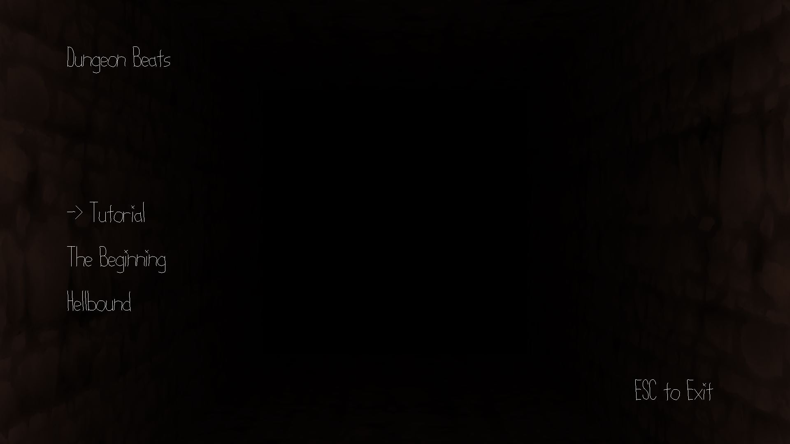
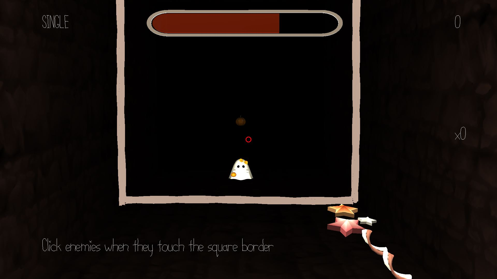
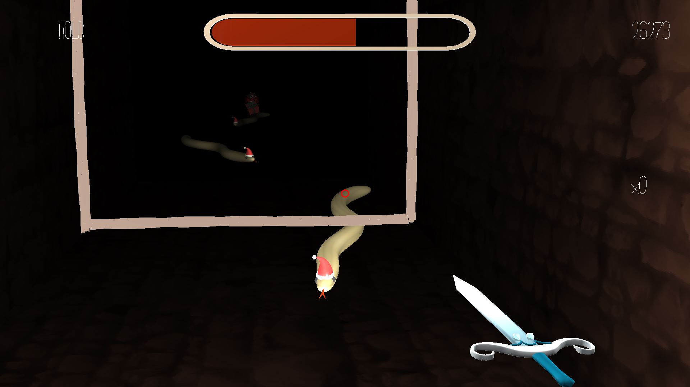
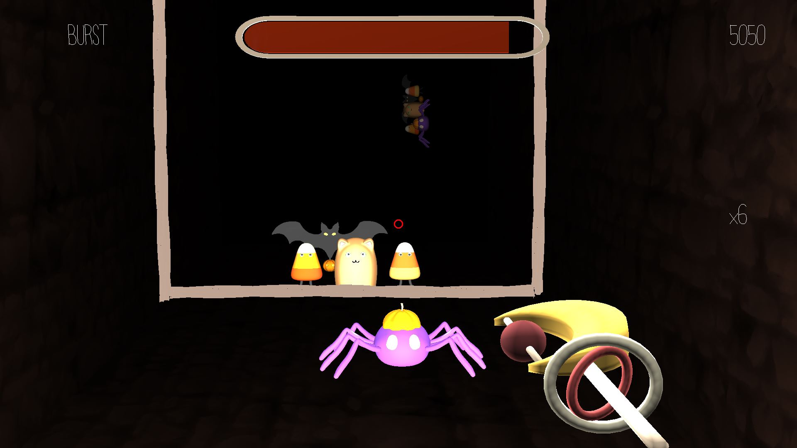

# Dungeon Beats

Author: Pewpewpew (Alan Lee, Joanna Yao, Daniel Zeng)

Design: Dungeon Beats is an FPS-Rhythm game.

Screen Shot:

How To Play:

Mouse movement to aim and left click to shoot enemies.

Use UP/DOWN arrow keys and enter to select text options.

Use ESC to pause/unpause the game while playing and to gain back mouse control or close the game if pressed from the menu.

Use Z to move back through guns and X to move forward through guns.

Use - and = to adjust mouse sensitivity.

Sources:

Note_hit.wav: https://freesound.org/people/Sorinious_Genious/sounds/561089/ 

Note_miss.wav: https://freesound.org/people/Zuckbeats219/sounds/520737/ 

Menu_background.wav: https://freesound.org/people/LittleRobotSoundFactory/sounds/270387/

All other in-game songs have been created by Soo Hyun (Alan) Lee, who reserves full copyright over their usages.

This game was built with [NEST](NEST.md).

